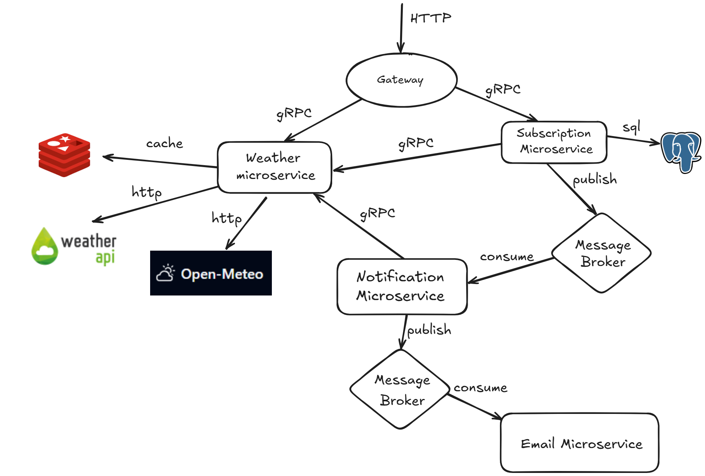

# ADR-003: Split monolith into microservices

**Status:** Accepted  
**Date:** 2025-07-07  
**Author:** Bilokur Evgen

Context
-------

Our current monolithic architecture faces challenges with scalability, deployment complexity, and technology stack limitations. With growing team size and application functionality, there's a need to transition to a more flexible architecture that supports independent service development and deployment.

Decision
--------

We will migrate to a microservices architecture using a combination of HTTP/REST and gRPC protocols for inter-service communication, with message brokers for asynchronous processing.

Architecture Overview
---------------------

### Core Components

#### 1\. API Gateway

*   **Purpose**: Single entry point for all client requests

*   **Responsibilities**:

    *   Request routing and load balancing

    *   Rate limiting and throttling

    *   Request/response logging and monitoring

    *   Protocol translation (HTTP to gRPC)

*   **Communication**: HTTP/REST for clients, gRPC for internal services

#### 2\. Weather Microservice

*   **Purpose**: Weather data processing and management

*   **Responsibilities**:

    *   Integration with external weather APIs (Weather API, Open-Meteo)

    *   Weather data caching and optimization

    *   City validation

*   **Data Storage**: Redis cache for fast data retrieval

*   **Communication Protocols**:

    *   HTTP for external API calls

    *   gRPC for internal service communication

*   **External Dependencies**: Weather API, Open-Meteo service

#### 3\. Subscription Microservice

*   **Purpose**: User subscription and preference management

*   **Responsibilities**:

    *   Subscription creation and confirmation

    *   User data persistence

    *   Task queue publishing: Publishes scheduled notification tasks to message broker

*   **Data Storage**: PostgreSQL database

*   **Communication**: gRPC for internal service communication

#### 4\. Notification Microservice

*   **Purpose**: Notification generation and orchestration

*   **Responsibilities**:

    *   Task consumption: Consumes scheduled tasks from message broker

    *   Weather data retrieval: Makes requests to Weather Microservice for weather conditions

    *   Notification generation: Creates notification content based on weather conditions
        
    *   Email dispatch: Sends notifications via Email Microservice

*   **Communication**: gRPC for service-to-service, message publishing for async processing

#### 5\. Email Microservice

*   **Purpose**: Email delivery and management

*   **Responsibilities**:

    *   Email template processing

    *   SMTP integration

    *   Delivery status tracking

    *   Email queue management

*   **Communication**: Message broker consumption for async processing

Communication Protocols
-----------------------

### gRPC Protocol Benefits

*   **Performance**: Binary serialization with Protocol Buffers

*   **Type Safety**: Strongly typed contracts with code generation

*   **Streaming**: Support for bidirectional streaming

*   **Language Agnostic**: Cross-language service communication

### HTTP/REST Protocol Benefits

*   **Simplicity**: Easy to understand and implement

*   **Tooling**: Extensive ecosystem and debugging tools

*   **Caching**: Built-in HTTP caching mechanisms

*   **Client Compatibility**: Universal client support

### Message Broker Benefits

*   **Asynchronous Processing**: Decoupled service communication

*   **Reliability**: Message persistence and delivery guarantees

*   **Scalability**: Horizontal scaling of message processing

*   **Fault Tolerance**: Service independence and resilience

## Pros and Cons of Microservices Architecture

### Pros
- Services can be **scaled independently**, improving system throughput under high load.
- **Improved fault isolation**: failure in one component (e.g., email service) does not crash the entire system.
- Deployment and development become more agile due to **smaller, focused components**.
- Enables **asynchronous communication** via message brokers, reducing inter-service latency and load on synchronous APIs.
- Asynchronous processing **reduces memory pressure**: we avoid holding large payloads in memory by streaming data or processing via task queues.
- The **subscription microservice** can use **cursor-based pagination** when reading large data sets from the database, preventing full in-memory loading.
- Easier to adopt **specialized storage/caching solutions** tailored to the needs of each service (e.g., Redis for caching, PostgreSQL for persistence).

### Cons
- Increased **operational complexity**: requires observability, service discovery, and monitoring infrastructure.
- Initial setup overhead: message broker, gateway, and CI/CD pipelines for each microservice.
- Requires **robust error handling and retries** for distributed communication.
- Debugging across multiple services can be more complex compared to a monolith.
- Inter-service communication may introduce **latency** and **serialization overhead** if not optimized properly.