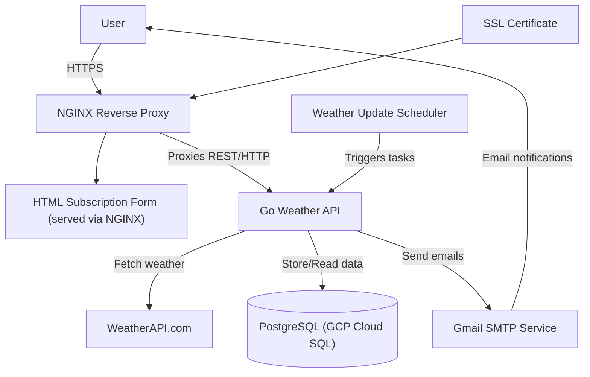

# System Design: Weather Forecast Subscription Service

## 1. System Requirements

### Functional Requirements:

- Retrieve current weather data for a given city from a third-party API (weatherapi.com).
- Allow users to subscribe to weather updates for specific cities with frequency selection (daily or hourly).
- Send a confirmation email containing a unique `token` immediately after successful subscription.
- Confirm user subscriptions via a unique `token` sent in the confirmation email.
- Ensure that users can only subscribe to a city once per email, preventing duplicate subscriptions.
- Send automated weather updates to confirmed subscribers via email based on their subscription frequency.
- Allow users to unsubscribe from weather updates at any time using an unsubscribe token.
- Provide an HTML subscription form for easy user interaction.

### Non-Functional Requirements:

- **Availability**: The system should be available 99.9% of the time.
- **Scalability**: The system should support up to 100,000 active subscriptions and handle 1,000 concurrent API requests.
- **Latency**: P95 < 500ms for weather data retrieval; P95 < 300ms for subscription operations (excluding email delivery).
- **Security**: All traffic must use HTTPS connections with SSL/TLS encryption.
- **Data Integrity**: Composite uniqueness constraint (email, city) enforced in PostgreSQL; migrations automatically applied on startup.
- **Maintainability**: Code should be modular with clear separation between handlers, services, and repositories.
- **Testability**: The system should have comprehensive unit and integration tests with >85% code coverage.
- **Observability**: Structured logging with centralized error tracking and monitoring capabilities.

### Constraints:

- **Budget**: Minimal budget for third-party services and GCP infrastructure.
- **Weather API Limitation**: 1,000 requests per hour for [weatherapi.com](https://www.weatherapi.com/).
- **Email Delivery**: Gmail SMTP with rate limiting considerations for bulk email sending.
- **HTTPS Only**: All external endpoints must enforce HTTPS; plain HTTP requests are rejected.
- **Frequency Options**: Only `hourly` and `daily` frequencies are supported; custom intervals are out of scope.
- **Single Instance**: Currently designed for single-instance deployment with vertical scaling.

## 2. Load & Traffic Estimation

### Users & Traffic

- **Active users**: 25,000.
- **Average subscriptions per user**: 2-3.
- **Peak API requests**: 500 RPS.
- **Email messages sent**: ~300,000 / day.
- **Confirmation emails**: ~1,000 / day.

### Bandwidth

- **Incoming (user requests)**: ≈ 2 Mbps.
- **Outgoing (email delivery)**: ≈ 5 Mbps.
- **External API calls (Weather API)**: ≈ 20 Mbps peak.

## 3. High-Level Architecture


## 4. Design Components

The application implements **Domain-Driven Design (DDD)** architecture with clear separation between infrastructure, domain, and application layers. The folder structure follows DDD principles:

```
internal/
├── application/           # Application layer (use cases, commands, queries)
│   ├── command/          # Command handlers for operations
│   ├── common/           # Shared application utilities
│   ├── email/            # Email application services
│   ├── query/            # Query handlers for data retrieval
│   ├── scheduled/        # Scheduled task handlers
│   └── services/         # Application service implementations
├── domain/               # Domain layer (business logic, entities, repositories)
│   ├── models/           # Domain entities and value objects
│   ├── repositories/     # Repository interfaces
│   └── validator/        # Domain validation logic
├── infrastructure/       # Infrastructure layer (external concerns)
│   ├── db/              # Database implementations
│   ├── email/           # Email service implementations
│   ├── http/            # HTTP server configuration
│── interface/       # External interface implementations
│   └── rest/    # REST API controllers
│         ├── dto/     # Data Transfer Objects
│         ├── subscription_controller.go
│         └── weather_controller.go
├── test/  # Integration tests that cover full controllers interactions
├── config/              # Configuration management
├── migrations/          # Database migration files
└── pkg/                # Shared packages and utilities
```

# 4.1. Domain Layer

The **Domain Layer** focuses on the core business logic of the application. It defines the essential entities and behaviors that model the problem space — in this case, weather notifications and user subscriptions.

## Key Responsibilities

* Encapsulate domain rules and constraints
* Represent core concepts using domain models
* Define business-driven interfaces for repositories and validation

## Main Models

* `Subscription` – represents a user's subscription to weather updates (email, city, frequency, confirmation status).
* `Weather` – encapsulates current, daily, and hourly weather data used in notifications.

## Additional Contracts

* **Repository Interfaces** – abstract persistence operations (`SubscriptionRepository`, `WeatherRepository`)
* **Validator Interface** – defines a contract for validating city names (`CityValidator`)

This layer is completely independent of frameworks and external systems — it reflects the **pure business logic** of the system.

# 4.2 Application Layer

The **Application Layer** coordinates the domain logic to fulfill specific use cases. It acts as the **orchestrator**, handling input from the interface layer, invoking domain services, and returning output.

### Key Responsibilities

*   Implement use cases such as creating a subscription or sending weather notifications

*   Coordinate between domain models, repositories, validators, and infrastructure

*   Define commands and queries to separate write/read logic

*   Schedule periodic background jobs (hourly/daily notifications)

# 4.3 Infrastructure Layer

The **Infrastructure Layer** provides low-level technical capabilities and concrete implementations for the interfaces defined in the **Domain** and **Application** layers. It connects the core business logic to external systems like databases, email providers, and third-party APIs.

### Key Responsibilities

*   Implement data persistence using PostgreSQL

*   Send emails via SMTP

*   Fetch external weather data over HTTP


### Components

#### Database (db/)

Implements the SubscriptionRepository interface using PostgreSQL.


#### Email (email/)

Handles email delivery via Gmail SMTP. Implements logic to send:

*   Confirmation emails with token links

*   Periodic weather updates (hourly/daily)

*   Unsubscribe confirmation notifications


Uses Go's gomail and html/template for secure, dynamic email rendering and delivery.

#### HTTP Weather Client (http/)

Provides a concrete implementation of the WeatherRepository interface. It communicates with a third-party weather API (e.g., WeatherAPI.com) to retrieve:

*   Current weather

*   Hourly forecasts

*   Daily forecasts


It handles HTTP requests/responses, unmarshals JSON, and maps it to internal domain models.

This layer stays behind clean interfaces, allowing **easy testing** and **future replacement** of any external system with minimal impact.

# 4.4 Interface Layer

The **Interface Layer** is the entry point to the application. It exposes **HTTP endpoints** that users or external systems can call. This layer delegates requests to the **Application Layer**, which orchestrates the underlying domain logic.

### Key Responsibilities

*   Define REST API endpoints

*   Parse and validate HTTP requests

*   Return appropriate HTTP responses (JSON, HTML)

*   Handle routing, status codes, and error formatting


### Available Endpoints

#### Subscription Endpoints

*   POST /subscribeCreate a new subscription (email, city, frequency) and send confirmation email.

*   GET /confirm/{token}Confirm the subscription using the confirmation token.

*   GET /unsubscribe/{token}Unsubscribe using the unsubscribe token.


#### Weather Endpoints

*   GET /weather?city={city}Get the current weather for a specific city.


### Tech Stack

*   Go’s net/http for serving requests

*   gin for route definitions

*   Middleware for logging, error handling, and CORS

*   JSON serialization for API responses

*   HTML rendering for static frontend (subscription form)

## 5. Deployment Strategy

* **Environment**: Google Cloud Platform (GCP).
* **Database**: GCP Cloud SQL (PostgreSQL) with automated backups and high availability.
* **Compute**: GCP Virtual Machine with Docker Engine installed.
* **Reverse Proxy**: NGINX configured as reverse proxy with SSL termination.
* **SSL Certificate**: Namecheap SSL certificate for HTTPS enforcement.
* **Domain**: Custom domain (b1lokcode.me) with DNS configuration.
* **Containerization**: Multi-stage Dockerfile for optimized Go binary.
* **Registry**: Docker Hub for container image storage.
* **CI/CD Pipeline**:
    - GitHub Actions workflow triggered on code push.
    - Run unit and integration tests with Testcontainers.
    - Build and push Docker image to Docker Hub.
    - SSH into GCP VM and deploy new container version.
    - Health check verification post-deployment.
* **Configuration Management**: Environment variables for secrets and configuration.
* **Monitoring**: Structured JSON logging with error tracking capabilities.

## 6. Testing Strategy

### Unit Tests

Unit tests focus on individual functions and methods to ensure correctness in isolation, particularly for business logic and data transformations.

#### Key Areas to Test:

* **Weather Service**:
    * Validate weather API response parsing and error handling.
    * Test weather data caching logic and cache invalidation.
    * Verify API rate limiting and retry mechanisms.
* **Subscription Service**:
    * Test subscription creation, validation, and uniqueness constraints.
    * Verify token generation, validation, and expiration logic.
    * Test subscription confirmation and unsubscription workflows.
* **Email Service**:
    * Test email template rendering with various data inputs.
    * Verify SMTP connection handling and error scenarios.
    * Test email address validation and sanitization.

### Integration Tests

Integration tests validate component interactions and database operations using Testcontainers for realistic testing environments.

#### Key Areas to Test:

* **Database Operations**:
    * Test subscription CRUD operations with PostgreSQL.
    * Verify database constraints and transaction handling.
    * Test migration execution and schema consistency.
* **HTTP API Integration**:
    * Test complete API request/response cycles.
    * Verify middleware functionality and error handling.
    * Test concurrent request handling and resource cleanup.
* **External Service Integration**:
    * Test weather API integration with mock responses.
    * Verify email delivery with test SMTP server.

### End-to-End Tests

End-to-End tests validate complete user workflows through the HTTP interface, database persistence, and email delivery.

#### Key Areas to Test:

* **Complete Subscription Flow**:
    * Test user subscription from HTML form submission to email confirmation.
    * Verify subscription lifecycle: `POST /subscribe` → confirmation email → `GET /confirm/{token}` → weather updates → `GET /unsubscribe/{token}`.
    * Test error scenarios like invalid tokens, expired confirmations, and duplicate subscriptions.

## 7. Future Enhancements

* **Horizontal Scaling**:
    * Implement load balancing with multiple application instances.
    * Add Redis for distributed caching and session management.
    * Implement database read replicas for query distribution.
* **Move to a Better Weather API**:
    * Switch to a more reliable and feature-rich weather API like OpenWeather for more accurate and comprehensive data.
* **Enhanced User Experience**:
    * Implement user accounts with authentication and subscription management dashboard.
    * Add support for multiple cities per user subscription.
    * Implement preference management (temperature units, notification timing).
* **Map Selection**
    * Implement a map selection feature, similar to OpenStreetMap, allowing users to comfortably choose their location on the map instead of manually entering city names.
* **Add PGCursor and Message Broker**
    * Integrate PGCursor to handle large datasets more efficiently in the database.
    * Implement a message broker (like RabbitMQ or Kafka) to manage asynchronous operations and improve scalability.
* **Performance Optimizations**:
    * Implement Redis caching for weather data and session storage.
    * Add CDN for static content delivery.
    * Implement asynchronous email processing with message queues.
* **Observability & Monitoring**:
    * Integration with monitoring platforms (Prometheus, Grafana, or Datadog).
    * Add comprehensive metrics collection and alerting.
    * Implement distributed tracing for performance analysis.
* **Geographic Features**:
    * Add support for location-based subscriptions using geolocation.
    * Implement weather data for coordinates instead of city names only.
    * Add timezone-aware scheduling for daily notifications.
* **Data Analytics**:
    * Implement subscription analytics and usage reporting.
    * Add A/B testing framework for email templates and features.
    * Implement user behavior tracking and engagement metrics.
* **CI/CD Managed Migrations**
    * Move database schema migrations to a dedicated CI/CD pipeline step.
    * Ensure database schema is validated and applied before application deployment.
    * Improve debugging and control by decoupling migrations from runtime logic.